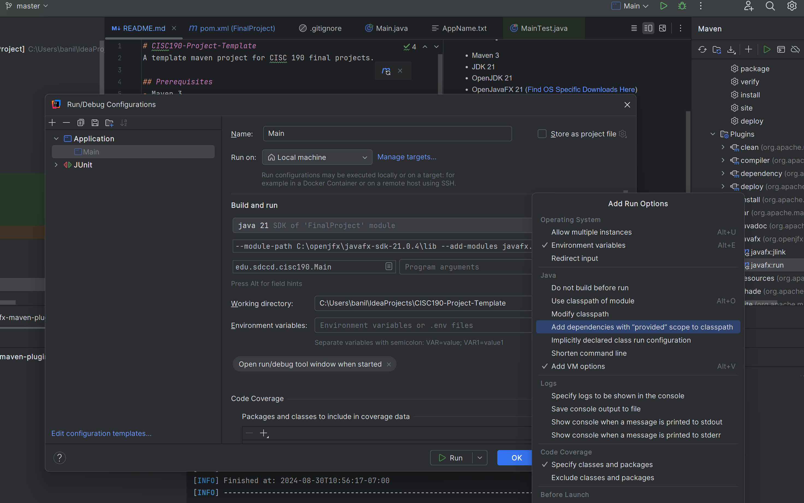

# CISC190-Project-Template
A template maven project for CISC 190 final projects.

## Prerequisites
- git 2
- maven 3
- JDK 21
- OpenJavaFX 21 ([Find OS Specific Downloads Here](https://gluonhq.com/products/javafx/))

## How to compile
mvn clean install

## How to run with maven
mvn javafx:run

## How to run with just Java
Replace /path/to/openjavafx to your actual install location of Open JavaFX:

java --module-path /path/to/openjavafx/lib --add-modules javafx.controls -jar .\target\FinalProject-0.0.1.jar

## How to run with IntelliJ
1. Open src/main/java/edu/sdccd/cisc190/Main.java
2. Press the green play button on Current File on the upper right.
3. A run configuration should automatically be generated for Main.
4. Click the run configuration drop down on the upper right and click Edit Configurations...
5. In the Run/Debug Configurations popup, select Main on the left nav.
6. Click the Modify options dropdown and select Add VM Options.
7. Add --module-path /path/to/openjavafx/lib --add-modules javafx.controls, changing /path/to/openjavafx to the location you have it installed on your machine
